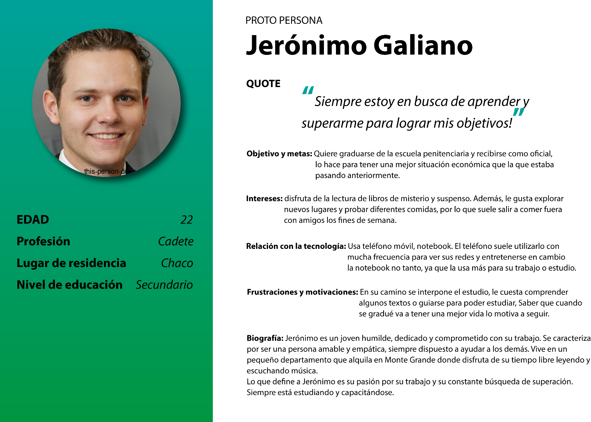

**Proyecto de diseño UX para Campus EPN**

**1. UX Research**

El UX Research se centra en la investigación mediante el uso de técnicas de observación, análisis de tareas y otras metodologías de retroalimentación, con el objetivo de comprender los comportamientos, necesidades y motivaciones de los usuarios. Es útil para poder definir el problema, ya que antes de ofrecer una solución debemos comprender el problema respetando el objetivo de la institución, pero diseñando para el usuario, basado en su experiencia y NO en la nuestra.

Para la investigación de usuario responderemos a las siguientes interrogantes:

**¿Quién es nuestro Usuario?** (Nos ayudara a basar nuestra investigación)

*Nuestros usuarios, son todas las personas que utilizan el Campus virtual EPN, ya sean cadetes, docentes o agentes.*

**¿Cuál es el Problema?** (Es la necesidad detectada)

*El problema que tienen la mayoría de nuestros usuarios, es la mala experiencia que reciben al utilizar la plataforma por múltiples razones.*

**¿Cuál es la Solución que vamos a ofrecer?**

*La solución que proponemos, es realizar un análisis de UX para implementar mejoras de diseño, jerarquía y estructura visual, de esta forma los usuarios podrían mejorar su experiencia y facilitar su desenvolvimiento en la plataforma.*

**2. Benchmarking**

El Benchmarking consiste en identificar información específica de otras instituciones que posean problemas similares y compáralos. Es un proceso de investigación que proporciona información valiosa para la toma de decisiones. En resumen, es tomar referencia de las mejores prácticas, procesos, funciones, operaciones o servicios que ofrecen otras instituciones en las cuales pretendemos mejorar.

Para realizar el Benchmarking utilizaremos 3 instituciones que posean campus virtuales y realizaremos un cuadro comparativo.

Tomaremos en cuenta las siguientes variables para el cuadro comparativo:

-   Nombres de la Institución y logo
-   Diseño visual del campus (Optimo, Bueno, Malo)
-   Distribución jerárquica y estructura de los contenidos dentro de un aula virtual
-   Cantidad de pasos por acción (Ingresar al campus, Ingresar a un aula)
-   Cantidad utilización de material multimedia.
-   Fortalezas y Debilidades observadas

Finalmente se realizará un breve informe con las conclusiones que se obtuvieron del cuadro, respondiendo a las siguientes interrogantes:

-   ¿Qué institución es?
-   ¿Quiénes son sus usuarios?
-   ¿Cómo les hablan?
-   ¿En qué se diferencian?
-   ¿Qué podemos ofrecer que ellos no dispongan en su campus?
-   ¿Cómo podemos superar su propuesta?

**2.1 Cuadro Benchmarking**

| Nombre                                             | Campus virtual de la Agencia de Aprendizaje a lo largo de vida                                                                                                                                                                                                                                                                                                                                                                                                                                                                                                                                                                                                                                                                                                                                                                                                                                                                                                                                                                                                                                                                                                                                                                                                                                                                                                                                                                                                                                                                                                                                                                                                      | Aulas Virtuales UTN.BA                                                                                                                                                                                                                                                                                                                                                                                                                                                                                                                                                                                                                                                                                                                                                                                                                                                                              | Argentina Programa 4.0                                                                                                                                                                                                                                                                                                                                                                                                                                                                                                                                                                                                                                                                                                                                                                                                                                                                                                                                                                                                                                                                                                                                                                                                                            |
|----------------------------------------------------|---------------------------------------------------------------------------------------------------------------------------------------------------------------------------------------------------------------------------------------------------------------------------------------------------------------------------------------------------------------------------------------------------------------------------------------------------------------------------------------------------------------------------------------------------------------------------------------------------------------------------------------------------------------------------------------------------------------------------------------------------------------------------------------------------------------------------------------------------------------------------------------------------------------------------------------------------------------------------------------------------------------------------------------------------------------------------------------------------------------------------------------------------------------------------------------------------------------------------------------------------------------------------------------------------------------------------------------------------------------------------------------------------------------------------------------------------------------------------------------------------------------------------------------------------------------------------------------------------------------------------------------------------------------------|-----------------------------------------------------------------------------------------------------------------------------------------------------------------------------------------------------------------------------------------------------------------------------------------------------------------------------------------------------------------------------------------------------------------------------------------------------------------------------------------------------------------------------------------------------------------------------------------------------------------------------------------------------------------------------------------------------------------------------------------------------------------------------------------------------------------------------------------------------------------------------------------------------|---------------------------------------------------------------------------------------------------------------------------------------------------------------------------------------------------------------------------------------------------------------------------------------------------------------------------------------------------------------------------------------------------------------------------------------------------------------------------------------------------------------------------------------------------------------------------------------------------------------------------------------------------------------------------------------------------------------------------------------------------------------------------------------------------------------------------------------------------------------------------------------------------------------------------------------------------------------------------------------------------------------------------------------------------------------------------------------------------------------------------------------------------------------------------------------------------------------------------------------------------|
| **Link**                                           | https://aulasvirtuales.bue.edu.ar/                                                                                                                                                                                                                                                                                                                                                                                                                                                                                                                                                                                                                                                                                                                                                                                                                                                                                                                                                                                                                                                                                                                                                                                                                                                                                                                                                                                                                                                                                                                                                                                                                                  | https://aulasvirtuales.frba.utn.edu.ar/                                                                                                                                                                                                                                                                                                                                                                                                                                                                                                                                                                                                                                                                                                                                                                                                                                                             | https://campus.argentinaprograma.utn.edu.ar/                                                                                                                                                                                                                                                                                                                                                                                                                                                                                                                                                                                                                                                                                                                                                                                                                                                                                                                                                                                                                                                                                                                                                                                                      |
| **Logo**                                           |                                                                                                                                                                                                                                                                                                                                                                                                                                                                                                                                                                                                                                                                                                                                                                                                                                                                                                                                                                                                                                                                                                                                                                                                                                                                                                                                                                                                                                                                                                                   |                                                                                                                                                                                                                                                                                                                                                                                                                                                                                                                                                                                                                                                                                                                                                                                                                                      |                                                                                                                                                                                                                                                                                                                                                                                                                                                                                                                                                                                                                                                                                                                                                                                                                                                                                                                                                                                                                                                                                                                                                                              |
| **Diseño visual**                                  | Diseño moderno con bordes cuadrados, apariencia predefinida del theme boots con colores personalizados atribuidos a la institución.                                                                                                                                                                                                                                                                                                                                                                                                                                                                                                                                                                                                                                                                                                                                                                                                                                                                                                                                                                                                                                                                                                                                                                                                                                                                                                                                                                                                                                                                                                                                 | Diseño moderno con bordes cuadrados, apariencia predefinida del theme boots con colores personalizados atribuidos a la institución.                                                                                                                                                                                                                                                                                                                                                                                                                                                                                                                                                                                                                                                                                                                                                                 | Diseño moderno con bordes cuadrados, apariencia predefinida del theme boots con colores personalizados atribuidos a la institución.                                                                                                                                                                                                                                                                                                                                                                                                                                                                                                                                                                                                                                                                                                                                                                                                                                                                                                                                                                                                                                                                                                               |
| **Distribución jerárquica y estructura**           | En la página de cursos, lo primero que se visualiza son los cursos en los cuales está matriculado el usuario. Dentro del aula virtual, lo primero en visualizar y de forma destacada es el Nombre del curso, luego se visualizan unas pestañas en las cuales se encuentran los temas que dispone el curso, por último, se ve el contendió general del curso. Dentro del contenido del curso, lo primero en visualizar es un mensaje de bienvenida en donde se explica a qué instituto o programa pertenece el curso y luego se visualiza un “genially” el cual muestra el funcionamiento de la plataforma, como serán las comunicaciones, como se desarrollarán las clases y las actividades, las condiciones de cursadas, las condiciones de aprobación, material teórico de las clases y la participación de la misma. Luego se incluye una actividad obligatoria y restrictiva sobre el contenido dado en el “genially”. Luego se muestra una pestaña de inicio, en la cual lo primero que se visualiza es una cartelera de novedades y un foro de consultas, luego se visualiza un “genially” en el cual se muestran los ejes temáticos y contenidos del curso, acompañado de un PDF en caso de no visualizar el genially. Las pestañas que contienen material del curso, se estructuran de la siguiente manera: un banner que indica los materiales del curso, seguido de un libro en formato actividad que muestra todos los contenidos del tema, seguido de 2 PDF relacionados a ese libro para descargas y luego otro banner que dice actividad seguido de una actividad relacionada al material dado. Todas las actividades o recursos son de auto-marcado | En la página de cursos, lo primero que se visualiza son los cursos visitados recientemente luego los cursos matriculados y además en la sección derecha se visualiza un calendario, un módulo de asistencia técnica y un espacio similar a una biblioteca virtual. Dentro del aula virtual, lo primero en visualizar va a depender el docente, no hay una estructura organizada definida, solamente existe una apariencia de cajones los cuales representan diferentes módulos. Además, cuando se ingresa, automáticamente la página hace focus en la última actividad abierta por el usuario. Dentro del cajón de modulo, lo que se visualiza son los contenidos y estos dependerán del docente, se encuentra un patrón recurrente de colocar la actividad a lo último luego de todo el material. Los recursos utilizados son únicamente, diapositivas de PowerPoint, PDF, link a recurso externo. | En la página de cursos, lo primero que se visualiza son los cursos en los que el usuario está matriculado y en la parte derecha se visualiza una línea del tiempo de actividades por hacer. Dentro del aula virtual, lo primero en visualizar y de forma destacada es el Nombre del curso, luego se visualizan unas pestañas en las cuales se encuentran las clases dictadas, y una pestaña inicial que se llama “General” en donde se da la bienvenida del curso, se explica a qué programa pertenece, como se va a dictar y tiene un sistema de asistencias. Luego lo primero que se ve dentro de la clase es una estructura en donde se indica el tema a dar, proseguido del link de acceso a la video llamada, debajo de este una etiqueta que posee un link para dar el presentimos dentro del mismo campus. Luego otra sección en donde se muestra el link de la clase grabada. Después una sección más en la cual se muestran los materiales de la clase utilizado y la bibliografía, y por ultimo una sección que posee 2 actividades, una actividad de cuestionario para responder con lo dado en la clase y otra actividad en formato a entregar con un límite de tiempo. Los recursos utilizados son, PDF y links a recursos externos. |
| **Cantidad de pasos para ingresar al campus**      | 3 pasos Ingresar al link Ingresar credenciales Hacer clic en botón de login                                                                                                                                                                                                                                                                                                                                                                                                                                                                                                                                                                                                                                                                                                                                                                                                                                                                                                                                                                                                                                                                                                                                                                                                                                                                                                                                                                                                                                                                                                                                                                                         | 3 pasos Ingresar al link Ingresar credenciales Hacer clic en el botón de login                                                                                                                                                                                                                                                                                                                                                                                                                                                                                                                                                                                                                                                                                                                                                                                                                      | 3 pasos Ingresar al link Ingresar credenciales Hacer clic en el botón de login                                                                                                                                                                                                                                                                                                                                                                                                                                                                                                                                                                                                                                                                                                                                                                                                                                                                                                                                                                                                                                                                                                                                                                    |
| **Cantidad de pasos para ingresar al aula**        | 1 paso Una vez ingresado al campus, muestra directamente la pantalla de cursos matriculados, únicamente hay que hacer clic en el curso deseado e ingresa.                                                                                                                                                                                                                                                                                                                                                                                                                                                                                                                                                                                                                                                                                                                                                                                                                                                                                                                                                                                                                                                                                                                                                                                                                                                                                                                                                                                                                                                                                                           | 1 paso Una vez ingresado al campus, muestra directamente la pantalla de cursos matriculados, únicamente hay que hacer clic en el curso deseado e ingresa.                                                                                                                                                                                                                                                                                                                                                                                                                                                                                                                                                                                                                                                                                                                                           | 1 paso Una vez ingresado al campus, muestra directamente la pantalla de cursos matriculados, únicamente hay que hacer clic en el curso deseado e ingresa.                                                                                                                                                                                                                                                                                                                                                                                                                                                                                                                                                                                                                                                                                                                                                                                                                                                                                                                                                                                                                                                                                         |
| **Cantidad de utilización de material multimedia** | 2 pasos Una vez ingresado al aula, hay que seleccionar la pestaña al tema requerido y luego seleccionar el material a visualizar.                                                                                                                                                                                                                                                                                                                                                                                                                                                                                                                                                                                                                                                                                                                                                                                                                                                                                                                                                                                                                                                                                                                                                                                                                                                                                                                                                                                                                                                                                                                                   | 2 pasos Una vez ingresado al aula, hay que seleccionar la pestaña al tema requerido y luego seleccionar el material a visualizar.                                                                                                                                                                                                                                                                                                                                                                                                                                                                                                                                                                                                                                                                                                                                                                   | 2 pasos Una vez ingresado al aula, hay que seleccionar la pestaña al tema requerido y luego seleccionar el material a visualizar.                                                                                                                                                                                                                                                                                                                                                                                                                                                                                                                                                                                                                                                                                                                                                                                                                                                                                                                                                                                                                                                                                                                 |
| **Fortalezas**                                     | Diseño sencillo, estructura intuitiva y guiada                                                                                                                                                                                                                                                                                                                                                                                                                                                                                                                                                                                                                                                                                                                                                                                                                                                                                                                                                                                                                                                                                                                                                                                                                                                                                                                                                                                                                                                                                                                                                                                                                      | Diseño principal sencillo, utiliza únicamente recursos descargables como PDF los cuales también tienen un visor incorporado para evitar descargar en caso de no ser necesario La visión del curso es de pantalla completa                                                                                                                                                                                                                                                                                                                                                                                                                                                                                                                                                                                                                                                                           | Diseño, simple, estructurado y organizado, intuitivo.                                                                                                                                                                                                                                                                                                                                                                                                                                                                                                                                                                                                                                                                                                                                                                                                                                                                                                                                                                                                                                                                                                                                                                                             |
| **Debilidades**                                    | No todos los materiales multimedia, poseen su versión texto o PDF, lo que encuadra en una falla de accesibilidad. En la pantalla de curso se divide en 2 columnas, una para el contenido y otra para el calendario, lo que disminuye la cantidad de espacio disponible para observar el material del curso.                                                                                                                                                                                                                                                                                                                                                                                                                                                                                                                                                                                                                                                                                                                                                                                                                                                                                                                                                                                                                                                                                                                                                                                                                                                                                                                                                         | La estructura del aula no es comprensible, posee un diseño poco entendible dentro del aula. Falta de información, sobre el curso, actividades o recursos.                                                                                                                                                                                                                                                                                                                                                                                                                                                                                                                                                                                                                                                                                                                                           | En las pestañas de los módulos no indica que tema es el que se habla, tienes que ingresar uno por uno para poder ver el tema.                                                                                                                                                                                                                                                                                                                                                                                                                                                                                                                                                                                                                                                                                                                                                                                                                                                                                                                                                                                                                                                                                                                     |

**2.2 Informe sobre los campus virtuales de las instituciones comparadas:**

**El Campus Virtual de la Agencia de Aprendizaje a lo largo de vida**, está dirigido a las personas que desean capacitarse sin importar su edad, la forma en la que se dirigen en sus cursos es agradable y motivadora, la diferencia notable que poseen es que utilizan genially a diferencia de los otros dos campus además cuenta con un diseño moderno y una estructura jerárquica y guiada que resulta intuitiva para el usuario. Además, el acceso al aula virtual es rápido y directo, lo que agiliza el proceso de ingreso al curso deseado. Sin embargo, una debilidad que presenta es la falta de accesibilidad para los materiales multimedia que no cuentan con su versión en texto o PDF. Además, la división de la pantalla en dos columnas puede limitar la cantidad de espacio disponible para la visualización del material del curso. En general, el Campus Virtual de la Agencia de Aprendizaje a lo largo de vida presenta fortalezas en cuanto a su diseño y estructura, pero aún hay aspectos en los que se puede mejorar para una experiencia más accesible y eficiente para los usuarios.

**El campus virtual de la UTN.BA**, está dirigido a los jóvenes de entre 18 y 30 años de edad, la forma de dirigirse no esta pre-establecida y depende del docente, la diferencia principal es el diseño estilo mosaico que poseen en las aulas. En general, el diseño visual del es moderno y sencillo, con una distribución jerárquica clara en la página de “Mis cursos”. Sin embargo, la estructura del aula virtual es poco organizada y depende completamente del docente, lo que puede dificultar la navegación y la comprensión para los estudiantes. Además, la cantidad de material multimedia es limitada y los recursos utilizados son principalmente diapositivas de PowerPoint y PDF. Por otro lado, la utilización de recursos descargables con visores incorporados es una fortaleza. En resumen, se podría mejorar la estructura del aula virtual para brindar una mejor experiencia de usuario y utilizar una variedad de recursos multimedia para mejorar la calidad del contenido.

El **campus de programa Argentina Programa 4.0**, está dirigido para usuarios que poseen un rango de edad de 16 a 38 años, la forma en la que se dirigen a los usuarios es cordial, clara y sencilla, la diferencia principal es la organización que poseen en la estructura completa de todo el curso, tiene un diseño visual moderno y una estructura jerárquica bien definida y organizada. La página de cursos muestra los cursos en los que el usuario está matriculado y una línea de tiempo de actividades por hacer. Dentro del aula virtual, lo primero que se destaca es el nombre del curso y las pestañas de las clases dictadas. Además, se tiene una sección general que brinda información relevante del curso. En cuanto a los materiales utilizados, se encuentran PDF y links a recursos externos. La cantidad de pasos para ingresar al campus y al aula es de 3 y 1 paso respectivamente, lo cual es fácil y rápido para el usuario. Las fortalezas del programa son su diseño, estructura organizada y la utilización de materiales descargables. Sin embargo, una de las debilidades que se puede señalar es que en las pestañas de los módulos no se indica el tema que se va a tratar, lo cual puede resultar confuso para los estudiantes.

**3. Proto Persona**

Utilizaremos los datos recolectados, nuestras observaciones y suposiciones para crear una hipótesis.

Crearemos una proto persona, esto es una primera versión (sin validar) de lo que luego va a ser la User persona (validada a través de entrevistas).

La proto persona es una parte clave del diseño UX, nos permite asegurarnos de hablar al público objetivo y construir en detalle el reflejo de los deseos de estos.

La proto persona debe tener:

1.  Nombre, Apellido y profesión
2.  Datos demográficos, edad, sexo, nivel de educación, estado civil, ingresos.
3.  Biografia, una breve reseña de como es, como vive y que la define.
4.  Intereses – Hobbies, modo de vida.
5.  Hábitos de consumo, que consume, como lo hace, porque lo hace.
6.  Objetivos, sueños, metas. Que quiere hacer y porque
7.  Su relación con la tecnología, que usa, con qué frecuencia, para qué.
8.  Frustraciones y motivaciones, que se interpone en su camino, que los hace avanzar
9.  Una frase que identifique lo mejor posible como piensa.

**Proto persona:**

****

**4. Entrevistas cualitativas**

Es una técnica de investigación que permite recabar datos, tiene como propósito obtener información en relación a un tema determinado, para que la información sea lo más precisa posible. La entrevista nos sirve para poder validar nuestra proto persona y modificar en relación a los datos obtenidos y poder pasar a un User persona.

**5. Mapa de empatía**

El mapa de empatía es un esquema visual sobre el público objetivo, sirve para entender mejor a este prototipo de persona y por lo tanto poder satisfacer las necesidades.

Para realizarlo se responde a las siguientes preguntas:

-   **¿Qué piensa y que siente?** ¿Qué da sentido a su vida? ¿Qué le preocupa? ¿Qué le hace feliz? ¿Qué otros pensamientos y sentimientos podrían motivar su comportamiento?
-   **¿Qué ve?** ¿Qué ve en el mercado? ¿Qué ve en su entorno inmediato? ¿Qué ve a otros diciendo y haciendo? ¿Qué está viendo y leyendo?
-   **¿Qué escucha?** ¿Qué está oyendo decir a los demás? ¿Qué está escuchando de sus amigos? ¿Qué está escuchando de sus compañeros? ¿Que está escuchando de otros?
-   **¿Qué dice y hace?** ¿Qué le hemos oído decir? ¿Qué podemos imaginarle diciendo? ¿Qué comportamiento hemos observado? ¿Qué necesita hacer de manera diferente? ¿Qué decisiones debe tomar? ¿Cómo sabremos que tuvo éxito?
-   **¿Qué resultados espera?** ¿Cuáles son sus deseos? ¿Cuáles son sus necesidades? ¿Qué espera que suceda? ¿Cuáles son sus sueños?
-   **¿Qué lo frustra?** ¿Cuáles son sus miedos? ¿Cuáles son sus obstáculos? ¿Qué teme que suceda? ¿Cuáles son sus frustraciones? ¿Qué le causa ansiedad? ¿Qué lo enoja?

Si podemos observar, muchas de las preguntas del mapa de empatía, se relacionan o son idénticas a las utilizadas para crear la proto persona. Se discriminarán preguntas en relación al objetivo buscado.
